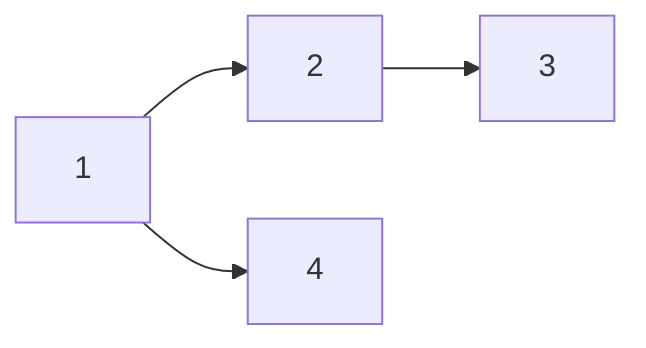

\#은 Header를 의미합니다.

# H1 태그
## H2 Tag
### H3 Tag
#### H4 Tag

\#를 5개 이상 쓴다는 것? -> 잘못된 분류!!


___

_italic_

**bold**

**_italic+bold_**

~~hello~~

> 안녕하세요 이건 Quote 입니다.

---

- list 1
- list 2
- list 3
    - A
        - B

1. list 1
2. list 2
3. list 3
    1. A
        1. B


|제목|Description|비고|
|-|-|-|
|안녕|1|2|
|할로|3|4|

---

[링크이름](naver.com)

<a href="naver.com">링크이름</a>


---

`simple code`

```cpp
#include <stdio.h>

int main(){
        printf("hello world");
        return 0;
}
```

// carbon : 코드 공유시 사용하는 툴

---

$a^2 + b^2 = c^2$

다음 중 $N$개를 고르시오.

$$(\alpha + \beta)^2 = \alpha^2 + 2 \alpha \beta + \beta^2$$

---


